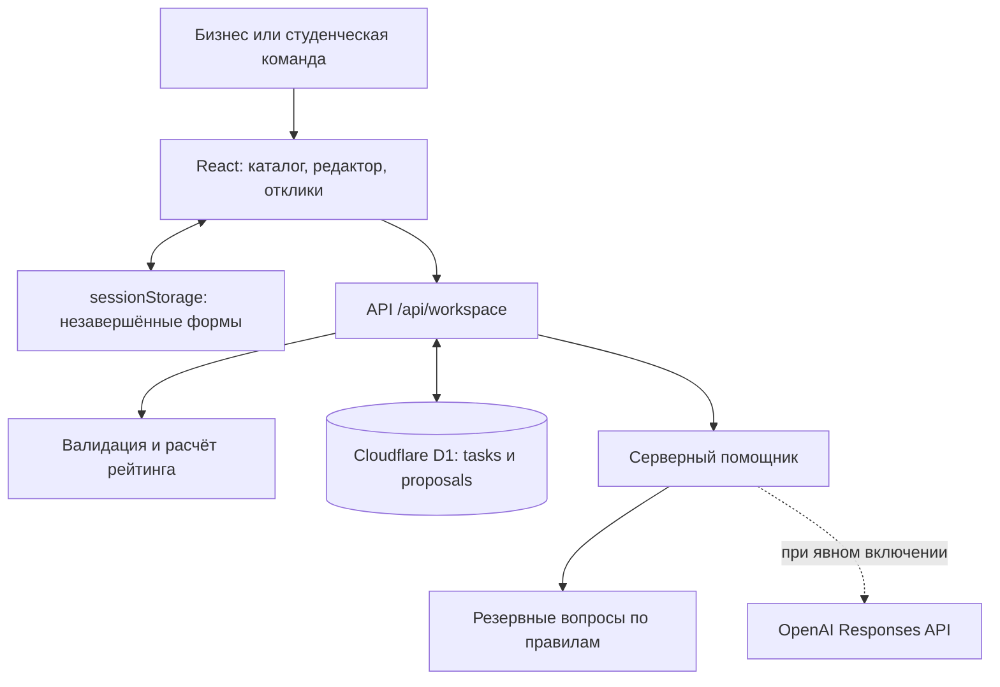

# AI Sana Challenge Hub

**От короткого запроса бизнеса — к понятной задаче и предложениям студенческих команд.**

Проект команды **DoubleMid** для хакатона **HackAlem AI**. Владелец кейса: **МНВО — AI Sana**.

[Репозиторий](https://github.com/BAITC-Hacks/hack-0f8b3a7c-doublemid) · [Подробный сценарий проверки](docs/CLICK-THROUGH.md) · [Демо и питч](docs/DEMO-AND-PITCH.md)

> **Статус:** учебный MVP с серверным сохранением данных и переключением демонстрационных ролей. Основной сценарий работает без внешнего AI: используются вопросы по правилам. Адаптер OpenAI реализован и проверен на имитациях ответов; реальный запрос к модели ещё не проверен. Подтверждённой публичной ссылки на развёрнутое приложение в репозитории нет.

## 1. Проблема и пользователи

Бизнес часто описывает задачу одной фразой: «Хотим автоматизировать заявки клиентов». Студентам неясно, какие данные доступны, что нужно сделать и как будет оцениваться результат.

AI Sana помогает представителю бизнеса уточнить запрос, заполнить структурированную карточку и увидеть её готовность к работе. Студенческие команды находят задачи в каталоге и предлагают решения. Бизнес сравнивает предложения и сам выбирает исполнителей.

**Ценность для бизнеса:** видны пробелы в постановке задачи и предложения команд. **Ценность для студентов:** понятнее контекст, ожидаемый результат, ограничения и критерии приёмки.

## 2. Что реализовано

| Возможность | Как работает в MVP |
|---|---|
| Конструктор задачи | Исходное описание → уточняющие вопросы → редактируемая карточка |
| Уточняющий помощник | Задаёт не менее трёх вопросов; предусмотрены OpenAI и резервные вопросы по правилам |
| Карточка | Название, организация, тема и девять полей: контекст, потребность, пользователи, данные, ограничения, результат, критерии успеха, контакт, взаимодействие |
| Рейтинг готовности | Оценка 0–100, объяснение весов, перечень недостающих сведений, пересчёт после изменений |
| Каталог | Поиск по задачам и организациям, фильтры по теме и готовности, сортировка по убыванию рейтинга |
| Отклики | Команда указывает идею, план, срок и ссылку на прототип; низкий рейтинг не запрещает отклик |
| Решение бизнеса | Можно выбрать одну или несколько команд, отклонить предложения или оставить их без решения |
| Подтверждение результата | Бизнес описывает проверенный этап; команда получает 20 баллов один раз за отклик |
| Сохранение | Задачи и отклики хранятся на сервере; незавершённые формы восстанавливаются после обновления текущей вкладки |
| Надёжность | Валидация ввода, защита от повторной отправки отклика и конфликтующих правок, сообщения об ошибках внутри формы |
| Интерфейс | Русский язык, деловой реестр задач, адаптация для телефона, фильтры статусов откликов |

В комплекте: **5 примеров исходных описаний, 5 опубликованных задач, 5 команд и 5 откликов**. Новое пространство браузера получает этот набор автоматически.

### Правила рейтинга

Рейтинг показывает **полноту подтверждённого описания**, а не известность компании, качество идеи или доказанную эффективность решения.

| Поле | Баллы |
|---|---:|
| Контекст | 10 |
| Потребность | 10 |
| Пользователи | 10 |
| Данные и материалы | 20 |
| Ограничения | 10 |
| Ожидаемый результат | 15 |
| Критерии успеха | 15 |
| Контакт бизнеса | 5 |
| Формат взаимодействия | 5 |
| **Всего** | **100** |

Поле учитывается, если после удаления пробелов по краям в нём не менее восьми символов. Простые заглушки «не знаю», «нет данных», «не указано», «уточняется», «пока нет», «неизвестно» не учитываются.

До подтверждения сведений редактор показывает предварительную оценку; сохранённая неподтверждённая задача имеет 0 баллов. Сервер рассчитывает итог самостоятельно. Изменение поля снимает подтверждение в редакторе.

| Баллы | Уровень |
|---|---|
| 0–39 | Требует уточнения |
| 40–69 | Рабочая |
| 70–89 | Готовая |
| 90–100 | Приоритетная |

Опубликованные задачи доступны командам при любом балле. При одинаковом рейтинге более новая карточка располагается выше. Неопубликованные черновики остаются в разделе «Мои задачи».

## 3. Как работает решение

1. **Бизнес вводит проблему** свободным текстом и выбирает тему.
2. **Помощник задаёт вопросы** по недостающим сведениям. Пользователь отвечает и видит предварительную оценку готовности.
3. **Бизнес собирает карточку**, редактирует формулировки, подтверждает сведения и публикует задачу.
4. **Команда находит задачу** в каталоге и отправляет идею, план, срок и ссылку на прототип.
5. **Бизнес принимает решение** по каждому предложению вручную.
6. **После проверки результата** бизнес подтверждает выполненный этап. Команде начисляются 20 баллов; подтверждение сохраняется.

AI предлагает вопросы. Ответы переносятся в поля карточки без генерации новых фактов. Рейтинг рассчитывает код, а публикация, выбор команды и подтверждение результата остаются за человеком.

## 4. Технологии

| Компонент | Используемые технологии |
|---|---|
| Язык приложения | TypeScript 5.9 |
| Интерфейс | React 19, компоненты shadcn/Radix, Tailwind CSS 4, Lucide, Sonner |
| Веб-фреймворк и сборка | Vinext 1.0 beta и Vite 8; структура App Router и совместимые API Next.js |
| Сервер | Обработчик `/api/workspace` в среде Cloudflare Workers |
| Данные | Cloudflare D1; локальная SQLite-совместимая база через Miniflare/Wrangler |
| Схема и миграции | Drizzle ORM/Drizzle Kit; текущие запросы выполняются через D1 API |
| AI | Серверный OpenAI Responses API, модель по умолчанию `gpt-5.4-mini`, структурированный JSON-ответ |
| Проверки | Node.js test runner, TypeScript, ESLint, Miniflare |
| Окружение разработки | Node.js 24, npm; зависимости зафиксированы в `package-lock.json` |
| Подготовка размещения | Конфигурация Sites и привязка D1 `DB`; наличие конфигурации не означает выполненный деплой |

В `package.json` также присутствует Next.js 16 как часть используемого окружения. Команды разработки и сборки запускают Vinext/Vite, а не стандартный сервер Next.js. NVIDIA Build и Brev не интегрированы.

## 5. Архитектура проекта



| Файл или каталог | Назначение |
|---|---|
| `app/page.tsx`, `app/globals.css` | Основной интерфейс и оформление |
| `components/hub/workspace-ui.tsx` | Реестр задач, рейтинг, карточки откликов и списки выбора |
| `app/api/workspace/route.ts` | Чтение пространства, вопросы, сохранение задачи, отправка отклика, решение, подтверждение этапа |
| `lib/domain.ts` | Типы, формула рейтинга, промпт, резервные вопросы и синтетические примеры |
| `lib/openai-questions.ts`, `lib/ai-config.ts`, `lib/ai-types.ts` | OpenAI-адаптер, настройки, проверка ответа и статусы помощника |
| `lib/editor-cache.ts`, `lib/request-body.ts` | Восстановление форм и ограниченное чтение JSON-запросов |
| `db/`, `drizzle/` | Схема, доступ к D1 и SQL-миграция |
| `scripts/` | Запуск, сборка и проверки |
| `docs/` | Архитектура, сценарии проверки, аудит и материалы защиты |
| `.openai/hosting.json`, `vite.config.ts` | Настройки окружения и привязка базы `DB` |

Браузер получает случайный идентификатор пространства в HttpOnly cookie. Сервер ограничивает операции записями этого пространства. В базе две таблицы: `tasks` и `proposals`; содержимое карточек и откликов хранится в JSON.

Версия `revision` предотвращает затирание устаревшей карточкой новых изменений. Идентификатор `requestId` позволяет безопасно повторить отправку того же отклика. Изменение решения и подтверждение этапа защищены условным обновлением записи.

**Граница демонстрации:** переключатель ролей не является авторизацией. Все роли доступны внутри одного браузерного пространства; между разными браузерами общего каталога пока нет.

## 6. Установка и запуск

### Требования

- Git для получения исходников.
- **Node.js 24 и npm** — версия, на которой выполнялись проверки. В `package.json` указан минимум Node.js 22.13.
- Интернет для установки зависимостей. После установки для демонстрационного сценария ключ OpenAI и аккаунт облачного провайдера не нужны.

Все команды ниже выполняются из корня клонированного репозитория.

### Шаг 1. Получить проект и зависимости

```sh
git clone https://github.com/BAITC-Hacks/hack-0f8b3a7c-doublemid.git
cd hack-0f8b3a7c-doublemid
npm ci
```

### Шаг 2. Собрать приложение

```sh
npm run build
```

Сборка создаёт `dist/client`, `dist/server` и конфигурацию `dist/server/wrangler.json`. Локальные переменные с ключами не должны включаться в артефакты сборки.

### Шаг 3. Создать таблицы локальной базы

Для новой базы выполните миграцию **один раз**:

```sh
node --import ./scripts/sites-env.mjs ./node_modules/wrangler/bin/wrangler.js d1 execute DB --local --config dist/server/wrangler.json --persist-to .wrangler/state --file drizzle/0000_keen_iron_lad.sql
```

Повторный запуск этой SQL-миграции на существующей базе может сообщить, что таблицы уже существуют. При обычном повторном запуске приложения этот шаг пропускается. Локальная база хранится в `.wrangler/state` и исключена из Git.

### Шаг 4. Запустить приложение

Для разработки:

```sh
npm run dev
```

В обычном локальном окружении скрипт задаёт порт `5173`. Откройте **адрес из вывода сервера**: он может отличаться при занятом порте или другом профиле окружения. Например: [http://localhost:5173](http://localhost:5173).

Для локального запуска уже собранной версии вместо сервера разработки:

```sh
npm start
```

Это локальный запуск через Wrangler, не публикация сайта в интернете. При первом открытии приложение автоматически создаёт демонстрационные записи в новом пространстве.

### Необязательное подключение OpenAI

Базовый сценарий проверки выполняется без этого шага. Для работы с моделью создайте `.env.local` по образцу [.env.example](.env.example):

```dotenv
OPENAI_API_KEY=
OPENAI_MODEL=gpt-5.4-mini
OPENAI_REQUESTS_ENABLED=false
```

Добавьте свой ключ только в локальный файл. Флаг `false` сохраняет демонстрационный режим даже при наличии ключа. После согласования расходов можно установить `OPENAI_REQUESTS_ENABLED=true` и перезапустить сервер разработки.

При включении отправляются исходное описание, тема и поля задачи. Значение отдельного поля контакта исключается; контакты, введённые внутри свободного текста, автоматически не удаляются. Ключ используется сервером. `.env.local` и `.dev.vars` исключены из Git; на размещённом сервере секреты потребуется настроить отдельно.

Параметры адаптера: до 12 000 символов входного JSON, до 1 800 выходных токенов, тайм-аут 15 секунд, без автоматических повторов. Ответ проверяется по структуре и допустимым полям. При ошибке, отказе или некорректном ответе пользователь получает резервные вопросы и объяснение причины.

## 7. Как проверить решение

### Сценарий для жюри: от запроса до выбранной команды

Используйте **один браузер**, меняя роль переключателем в шапке. Все приведённые ниже сведения вымышленные и предназначены для демонстрации.

1. Откройте приложение. В новом пространстве должны появиться **5 задач** с рейтингами **100, 85, 70, 45 и 20**, пять команд и пять откликов. Проверьте поиск и фильтр **«0–39 · Уточнить»**: задача Eco Campus остаётся доступной.
2. В роли **«Бизнес»** нажмите **«Создать задачу»**. Выберите тему **«Сервис»**, введите описание и нажмите **«Уточнить задачу»**:

   > Заявки клиентов приходят в почту и теряются при передаче между менеджерами. Хотим автоматизировать обработку.

3. Ответьте на вопросы. Нажмите **«Собрать карточку»**, укажите название **«ТЕСТ — единая очередь заявок»** и организацию **«Demo Service»**. На этом шаге можно заполнить все поля по таблице:

| Поле | Пример ответа |
|---|---|
| Контекст | Заявки теряются при передаче между менеджерами, статус приходится уточнять вручную. |
| Потребность | Собирать обращения в единой очереди и распределять их по категориям. |
| Пользователи | Три менеджера клиентского сервиса и руководитель отдела. |
| Данные и материалы | 100 синтетических заявок с категориями в CSV, доступ через куратора. |
| Ограничения | Прототип за две недели. Использовать только синтетические данные. |
| Ожидаемый результат | Веб-форма, очередь заявок и фильтр по статусу. |
| Критерии успеха | Все 20 тестовых заявок сохранены, не менее 18 правильно классифицированы. |
| Контакт бизнеса | Куратор учебного кейса: mentor@example.com |
| Формат взаимодействия | Консультация раз в неделю и письменный отзыв в течение двух дней. |

4. Проверьте оценку **100/100**. Подтвердите сведения галочкой и нажмите **«Опубликовать задачу»**. Новая карточка должна появиться в каталоге.
5. Переключитесь на **«Студенческая команда» → Qadam**, откройте задачу и нажмите **«Предложить решение»**. Заполните:

   - **Идея:** «Соберём единую очередь обращений с категориями и статусами».
   - **План:** «Уточним категории, создадим прототип, проверим на 20 синтетических заявках».
   - **Срок:** «2 недели».
   - **Ссылка:** `https://example.com/test-prototype` — демонстрационный адрес, не реальный прототип.

6. Нажмите **«Отправить предложение»**. В разделе **«Мои отклики»** должен появиться статус **«На рассмотрении»**.
7. Вернитесь в роль **«Бизнес» → «Отклики команд»**. Найдите свой отклик и нажмите **«Выбрать команду»**.
8. В рамках учебной демонстрации нажмите **«Подтвердить этап»**, введите «Учебная проверка: все 20 синтетических заявок сохранены, 18 распределены верно» и подтвердите. Ожидается **«Этап подтверждён · +20 баллов»**. В реальной работе результат подтверждается только после фактической проверки.
9. Обновите страницу: задача, отклик и подтверждение должны сохраниться. Выбранная роль может вернуться к «Бизнес» — это не потеря записей.

**Дополнительные проверки:**

- Измените поле после установки галочки — потребуется повторное подтверждение.
- Отправьте пустую форму отклика — сохранение должно быть заблокировано.
- Заполните часть карточки или отклика и обновите текущую вкладку — ввод должен восстановиться.
- Сохраните новую задачу как черновик — она должна быть в «Моих задачах», но отсутствовать в каталоге.
- Выберите фильтр **«Этап завершён»** — подтверждённый отклик должен остаться в списке.

Для исходного набора примеров используйте приватное окно или другой браузер: это создаст отдельное пространство, не удаляя текущие данные. Более подробная инструкция — [CLICK-THROUGH.md](docs/CLICK-THROUGH.md).

### Автоматические проверки без платных запросов

После установки зависимостей:

```sh
npx tsc --noEmit
node scripts/test-domain.mjs
node --test scripts/test-openai.mjs scripts/test-reliability.mjs
npm run build
node scripts/test-built.mjs
```

`test-built.mjs` запускает готовую сборку на свободном локальном порте, создаёт временную базу, проверяет страницу и клиентские файлы, затем выполняет серверный сценарий. Ключ не загружается, реальные AI-запросы выключены, база пользователя не используется.

Дополнительные команды:

```sh
# API-проверка уже работающего сервера; по умолчанию http://localhost:4173
node scripts/test-api.mjs
# Проверка отсутствия локального ключа в исходниках и сборке
# Требует .env.local с ключом, существующую dist и Git в PATH
node scripts/check-secret-boundary.mjs
```

Для другого адреса API-теста задайте `TEST_URL`. Например, в PowerShell:

```powershell
$env:TEST_URL = 'http://localhost:5173'
node scripts/test-api.mjs
```

API-тест создаёт отдельное пространство. Он требует выключенных реальных AI-запросов и проверяет публикацию при низком рейтинге, отклик, выбор, подтверждение, сохранение, изоляцию, неверные запросы, повторную отправку и конкурентные изменения.

**Зафиксированные проверки текущей версии:** 17 тестов OpenAI-адаптера на имитациях ответов и 9 тестов восстановления форм/чтения запросов прошли; доменные проверки, TypeScript, сборка и серверный сценарий также прошли. Интерфейс проверялся на компьютере и экранах шириной 390 и 320 px. Это проверка конкретных сценариев, а не гарантия отсутствия любых ошибок. Подробности — [отчёт об аудите](docs/REVIEW-AND-TESTING.md).

Для отдельной проверки модели предусмотрен `scripts/test-live-ai.mjs`. Он делает один реальный запрос только с флагом `--allow-paid-request`; запускать его следует после согласования расходов. Этот тест не входит в команды выше и ещё не выполнялся.

## 8. Данные и интеграции

- **Демонстрационные данные:** массивы `seedDrafts`, `seedTasks`, `teams`, `seedProposals` в `lib/domain.ts`. Названия организаций, контакты, задачи и предложения синтетические. Упоминания CSV/PDF внутри карточек описывают учебные условия; импорта этих файлов и подключённых наборов данных нет.
- **Данные пользователя:** текст карточек, отклики, решения и описания подтверждённых этапов сохраняются в D1. Незавершённые формы дополнительно сохраняются в `sessionStorage` текущей вкладки.
- **OpenAI:** внешний API используется только после явного включения. Модель по умолчанию — `gpt-5.4-mini`. Доступ ключа, баланс и качество реального ответа в этом проекте пока не подтверждены.
- **Cloudflare D1 / Workers:** база и среда выполнения; локально эмулируются установленными инструментами.
- **Sites:** в репозитории есть конфигурация привязки D1 и инфраструктура сборки. Публичное размещение не подтверждено.
- **Ссылки на прототипы:** принимаются HTTP(S)-адреса без логина и пароля. Приложение хранит ссылку, но не проверяет работоспособность или качество внешнего прототипа.

Автоматического импорта задач из внешних систем, отправки писем, подключения к университетским базам или NVIDIA-сервисам нет.

## 9. Ограничения текущей версии

1. **Демонстрационные роли вместо отдельных аккаунтов.** Нет регистрации организаций/команд и серверных прав на отдельные роли. Другой браузер получает другое пространство. Публичный многопользовательский каталог ещё не реализован.
2. **Рейтинг оценивает полноту текста.** Он не проверяет достоверность, смысл, измеримость критериев или реализуемость задачи. Длинный бессодержательный ответ может получить баллы.
3. **Живой AI не проверен.** OpenAI-адаптер протестирован на имитациях; по умолчанию работают вопросы по правилам. Одна только настроенная переменная ключа не подтверждает доступность модели.
4. **Карточку формирует пользователь.** Автоматического переписывания всего задания моделью, семантического matching и автоматического назначения команд нет.
5. **Лимиты AI действуют в одном экземпляре сервера.** Между реальными запросами пространства предусмотрена пауза 30 секунд. Это не постоянная квота и не финансовый лимит; для открытого пилота нужны авторизация и надёжный контроль расходов.
6. **Восстановление формы ограничено вкладкой.** Для постоянного хранения задачи нужно сохранить черновик; отклик сохраняется на сервере после отправки. Очистка cookie создаёт новое пространство и не является механизмом восстановления доступа к прежним записям.
7. **Подтверждение этапа ручное.** Нет автоматической проверки доказательств, загрузки файлов или системы нескольких этапов на один отклик.
8. **Публичный деплой не подтверждён.** Для реального пилота также потребуются настройка секретов, резервного копирования, мониторинга и прав доступа. Vinext используется в beta-версии.

## 10. Развёрнутая версия

**Подтверждённой публичной ссылки в текущем репозитории нет.** Для оценки используйте локальный запуск по разделу 6.

Адрес `localhost` доступен только на компьютере с запущенным сервером и не является ссылкой на deployed-версию. GitHub содержит исходный код и документацию, но сам по себе не запускает это приложение с сервером и базой.
| Аккаунт | Email               | Демо-пароль        |
| ------- | ------------------- | ------------------ |
| Админ   | `admin@sana.demo`   | `AdminSana2026!`   |
| Студент | `student@sana.demo` | `StudentSana2026!` |

## 11. Материалы для защиты

- [Архитектура и границы MVP](docs/ARCHITECTURE.md)
- [Пошаговая проверка с текстами для вставки](docs/CLICK-THROUGH.md)
- [Сценарий демо, структура питча и ответы жюри](docs/DEMO-AND-PITCH.md)
- [Настройка и статус OpenAI](docs/OPENAI-INTEGRATION.md)
- [Аудит, исправления и результаты проверок](docs/REVIEW-AND-TESTING.md)
