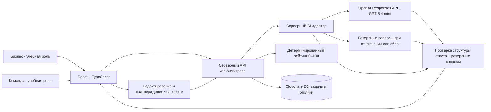

# Архитектура AI Sana Challenge Hub

## Границы ответственности

- Интерфейс показывает предварительный рейтинг и сохраняет ввод при ошибке.
- Сервер проверяет входные данные, сам рассчитывает баллы и ограничивает запросы текущим учебным пространством.
- База хранит карточки, решения по откликам и подтверждения этапов.
- AI-адаптер не добавляет факты, не назначает команды, не принимает решения бизнеса.
- Публикация карточки внутри каталога — действие пользователя приложения. Публикация самого сайта на хостинге — отдельная операция; в этой поставке она не выполнена.

## Ограничения и следующий этап

Текущая версия — демонстрационная среда одного браузера с переключением ролей. Для пилота нужны самостоятельные учётные записи, серверная проверка прав организаций и команд и общий каталог. GPT-5.4 mini подключена через серверный адаптер. До разрешения расходов реальные запросы выключены. Проверки выполнены без обращения к модели. Демо-адаптер остаётся резервным режимом. Рейтинг измеряет полноту, а не достоверность или качество самой идеи.

## Надёжность изменений

Карточки содержат версию `revision`. Сервер отклоняет устаревшие записи и обновляет payload только при совпадении с прочитанным состоянием. Тот же подход защищает подтверждение этапа от одновременного отклонения. Идентификатор попытки `requestId` делает повтор отправки одного отклика идемпотентным; новые предложения остаются неограниченными.

Тело запроса ограничено 60 000 байт при чтении потока, независимо от Content-Length. Все изменения требуют существующей сессии; дата создания определяется сервером. Незавершённые карточка и отклик дополнительно хранятся в sessionStorage текущей вкладки. Отклик восстанавливается вместе с исходным requestId, чтобы повтор после обновления не создавал дубликат. Это временный черновик, а не замена серверного сохранения.
