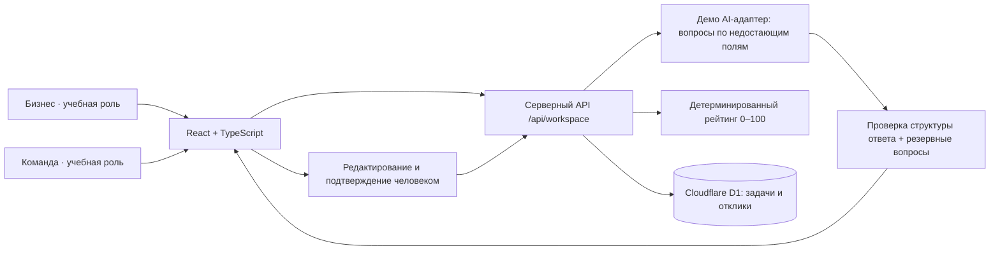

# Архитектура AI Sana Challenge Hub

## Границы ответственности

- Интерфейс показывает предварительный рейтинг и сохраняет ввод при ошибке.
- Сервер проверяет входные данные, сам рассчитывает баллы и ограничивает запросы текущим учебным пространством.
- База хранит карточки, решения по откликам и подтверждения этапов.
- AI-адаптер не добавляет факты, не назначает команды, не принимает решения бизнеса.
- Публикация карточки внутри каталога — действие пользователя приложения. Публикация самого сайта на хостинге — отдельная операция; в этой поставке она не выполнена.

## Ограничения и следующий этап

Текущая версия — демонстрационная среда одного браузера с переключением ролей. Для пилота нужны самостоятельные учётные записи, серверная проверка прав организаций и команд и общий каталог. Настоящая языковая модель подключается через серверный адаптер после согласования провайдера и бюджета. Демо-адаптер остаётся резервным режимом. Рейтинг измеряет полноту, а не достоверность или качество самой идеи.
